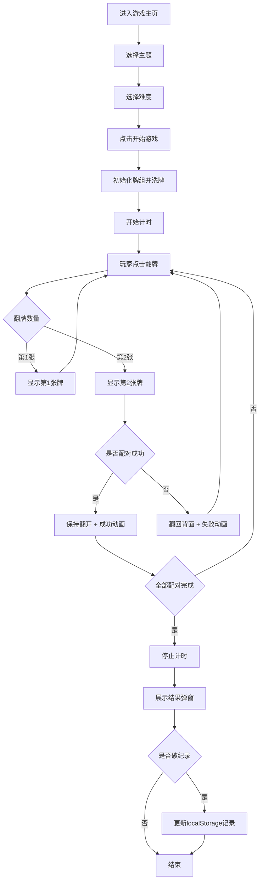

## 1. 产品概述

多主题记忆翻牌配对游戏，一款休闲益智类网页游戏，通过翻牌配对的方式锻炼玩家的记忆力。支持多种主题和难度，适合各年龄段用户。

- 核心目标：提供有趣的记忆力训练体验，支持多种主题和难度选择
- 目标用户：所有年龄段的休闲游戏玩家
- 产品价值：通过多样化的主题和难度等级，让玩家在游戏中提升记忆力

## 2. 核心功能

### 2.1 功能模块

1. **游戏主页**：主题选择、难度选择、开始游戏按钮、历史最佳记录展示
2. **游戏界面**：牌组网格、计时器、翻牌次数统计、重新开始按钮、返回主页按钮
3. **游戏结果**：完成弹窗展示用时、翻牌次数、是否打破记录

### 2.2 页面详情

| 页面名称 | 模块名称 | 功能描述 |
|---------|---------|---------|
| 游戏主页 | 主题选择 | 5种主题切换：数字、字母、动物图标、Emoji、自定义图片上传 |
| 游戏主页 | 难度选择 | 3种难度：4x4（8对）、6x6（18对）、8x8（32对） |
| 游戏主页 | 历史记录 | 展示各难度下的最快完成时间 |
| 游戏主页 | 音效开关 | 开启/关闭游戏音效 |
| 游戏界面 | 牌组网格 | 根据难度动态生成卡片网格，支持翻牌动画 |
| 游戏界面 | 状态栏 | 实时显示游戏用时和翻牌次数 |
| 游戏界面 | 操作按钮 | 重新开始、返回主页、音效开关 |
| 游戏结果 | 完成弹窗 | 展示最终用时、翻牌次数、是否破纪录、再玩一次按钮 |

## 3. 核心流程

## 4. 用户界面设计

### 4.1 设计风格
- **设计主题**：现代霓虹游戏风格，深色背景搭配霓虹发光效果
- **主色调**：深紫色/深蓝色渐变背景，霓虹青色和粉色作为强调色
- **卡片样式**：3D翻转动画，圆角卡片，悬浮发光效果
- **按钮风格**：霓虹发光按钮，圆角设计，悬停时增强发光效果
- **字体**：使用 Orbitron（科技感游戏字体）作为标题字体，Noto Sans SC 作为正文字体
- **布局风格**：居中卡片式布局，响应式网格

### 4.2 页面设计概览

| 页面名称 | 模块名称 | UI元素 |
|---------|---------|--------|
| 游戏主页 | 标题区域 | 霓虹发光大标题，带渐变色彩和动画 |
| 游戏主页 | 主题选择区 | 卡片式主题选择器，选中态有发光边框 |
| 游戏主页 | 难度选择区 | 按钮组形式，选中态高亮 |
| 游戏主页 | 最佳记录区 | 玻璃拟态卡片展示，按难度分类 |
| 游戏界面 | 顶部状态栏 | 计时器和翻牌次数，带图标 |
| 游戏界面 | 牌组区域 | 响应式网格，卡片3D翻转效果 |
| 游戏界面 | 底部操作区 | 操作按钮，音效开关 |
| 游戏结果 | 弹窗 | 玻璃拟态弹窗，彩色发光边框，动画展示 |

### 4.3 响应式设计
- **桌面端优先**：最大宽度限制，居中布局
- **平板适配**：网格自动调整列数，字体大小适配
- **手机适配**：单列/双列布局，触控区域放大，横屏优化

### 4.4 动画与交互
- **卡片翻转**：3D CSS transform 实现真实翻牌效果
- **配对成功**：卡片缩放+闪烁+发光脉冲动画
- **配对失败**：轻微抖动+红色闪烁提示
- **页面加载**：元素渐入+错峰动画
- **按钮悬停**：发光增强+轻微缩放
