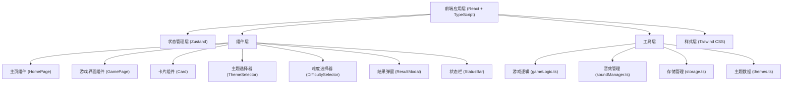

## 1. 架构设计



## 2. 技术描述

- **前端框架**: React@18 + TypeScript@5
- **构建工具**: Vite@5
- **样式方案**: Tailwind CSS@3
- **状态管理**: Zustand@4
- **路由管理**: React Router DOM@6
- **图标库**: Lucide React
- **数据存储**: LocalStorage (浏览器本地存储)
- **音效方案**: Web Audio API (程序化生成音效，无需外部资源)

## 3. 路由定义

| 路由 | 用途 |
|-----|------|
| / | 游戏主页（主题选择、难度选择、历史记录） |
| /game | 游戏界面（牌组、计时器、操作按钮） |

## 4. 数据模型

### 4.1 类型定义

```typescript
// 游戏主题类型
type ThemeType = 'numbers' | 'letters' | 'animals' | 'emoji' | 'custom';

// 难度类型
type DifficultyType = '4x4' | '6x6' | '8x8';

// 卡片状态
interface Card {
  id: string;
  value: string;
  isFlipped: boolean;
  isMatched: boolean;
}

// 游戏状态
interface GameState {
  theme: ThemeType;
  difficulty: DifficultyType;
  cards: Card[];
  flippedCards: string[];
  moves: number;
  startTime: number | null;
  endTime: number | null;
  isPlaying: boolean;
  isCompleted: boolean;
  soundEnabled: boolean;
  customImages: string[];
}

// 最佳记录
interface BestRecord {
  difficulty: DifficultyType;
  time: number;
  moves: number;
  date: string;
}
```

## 5. 核心模块设计

### 5.1 Zustand Store (游戏状态管理)

```typescript
// store/gameStore.ts
interface GameStore {
  // 状态
  theme: ThemeType;
  difficulty: DifficultyType;
  cards: Card[];
  flippedCards: string[];
  moves: number;
  elapsedTime: number;
  isPlaying: boolean;
  isCompleted: boolean;
  soundEnabled: boolean;
  customImages: string[];
  
  // 操作
  setTheme: (theme: ThemeType) => void;
  setDifficulty: (difficulty: DifficultyType) => void;
  startGame: () => void;
  flipCard: (cardId: string) => void;
  resetGame: () => void;
  toggleSound: () => void;
  addCustomImage: (imageData: string) => void;
  removeCustomImage: (index: number) => void;
}
```

### 5.2 游戏逻辑模块

```typescript
// utils/gameLogic.ts
- shuffleArray<T>(array: T[]): T[]  // Fisher-Yates 洗牌算法
- generateCards(theme: ThemeType, difficulty: DifficultyType, customImages?: string[]): Card[]
- checkMatch(card1: Card, card2: Card): boolean
- getPairCount(difficulty: DifficultyType): number
- formatTime(seconds: number): string
```

### 5.3 存储管理模块

```typescript
// utils/storage.ts
- saveBestRecord(difficulty: DifficultyType, time: number, moves: number): void
- getBestRecord(difficulty: DifficultyType): BestRecord | null
- getAllBestRecords(): Record<DifficultyType, BestRecord | null>
- saveSoundPreference(enabled: boolean): void
- getSoundPreference(): boolean
- saveCustomImages(images: string[]): void
- getCustomImages(): string[]
```

### 5.4 音效管理模块

```typescript
// utils/soundManager.ts
- playFlipSound(): void       // 翻牌音效
- playMatchSound(): void      // 配对成功音效
- playMismatchSound(): void   // 配对失败音效
- playWinSound(): void        // 游戏完成音效
```

## 6. 组件层级结构

```
src/
├── components/
│   ├── Card.tsx             // 单个卡片组件（3D翻转效果）
│   ├── ThemeSelector.tsx    // 主题选择器
│   ├── DifficultySelector.tsx // 难度选择器
│   ├── StatusBar.tsx        // 状态栏（计时器+步数）
│   ├── ResultModal.tsx      // 结果弹窗
│   ├── BestRecords.tsx      // 最佳记录展示
│   ├── ImageUploader.tsx    // 自定义图片上传组件
│   └── SoundToggle.tsx      // 音效开关
├── pages/
│   ├── HomePage.tsx         // 主页
│   └── GamePage.tsx         // 游戏页面
├── store/
│   └── gameStore.ts         // Zustand 状态管理
├── hooks/
│   └── useTimer.ts          // 计时器自定义Hook
├── utils/
│   ├── gameLogic.ts         // 游戏逻辑
│   ├── storage.ts           // 本地存储
│   ├── soundManager.ts      // 音效管理
│   └── themes.ts            // 主题数据
├── types/
│   └── index.ts             // TypeScript 类型定义
├── App.tsx
├── main.tsx
└── index.css
```
